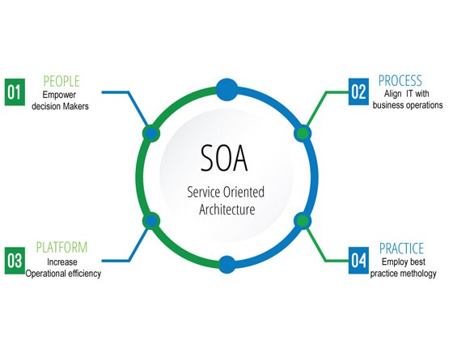

# Service-Oriented Architecture 
 In software engineering, service-oriented architecture (SOA) is an architectural style that supports service orientation.By consequence, it is as well applied in the field of software design where services are provided to the other components by application components, through a communication protocol over a network. A service is a discrete unit of functionality that can be accessed remotely and acted upon and updated independently, such as retrieving a credit card statement online. SOA is also intended to be independent of vendors, products and technologies.
 

## A service has four properties according to one of many definitions of SOA:
 

 It logically represents a repeatable business activity with a specified outcome :
#

<ol>
<li>It is self-contained.</li>
<li>It is a black box for its consumers, meaning the consumer does not have to be aware of the service's inner workings.</li>
<li>It may be composed of other services.</li>
</ol>

## Principles :
#

<ul>
  <li>Service abstraction: The services act as black boxes, that is their inner logic is hidden from the consumers.</li>
 <li>Service autonomy: Services are independent and control the functionality they encapsulate, from a Design-time and a run-time perspective.</li>
  <li>Service statelessness: Services are stateless, that is either return the requested value or give an exception hence minimizing resource use.</li>
 <li>Service discovery: Services are supplemented with communicative meta data by which they can be effectively discovered and interpreted.</li>
 <li>Service reusability: Logic is divided into various services, to promote reuse of code.</li>
 <li>Service encapsulation: Many services which were not initially planned under SOA, may get encapsulated or become a part of SOA.</li>
</ul>

## Why Service-Oriented Architecture Is Important :
#

### Use Service-Oriented Architecture to create reusable code:
#

 Not only does this cut down on time spent on the development process, but there’s no reason to reinvent the coding wheel every time you need to create a new service or process. Service-Oriented Architecture also allows for using multiple coding languages because everything runs through a central interface.
 ### Use Service-Oriented Architecture for scalability: 
 #

 It’s important to be able to scale a business to meet the needs of the client, however certain dependencies can get in the way of that scalability. Using Service-Oriented Architecture cuts back on the client-service interaction, which allows for greater scalability.

### Use Service-Oriented Architecture to reduce costs: 
#

 With Service-Oriented Architecture, it’s possible to reduce costs while still “maintaining a desired level of output.” Using Service-Oriented Architecture allows businesses to limit the amount of analysis required when developing custom solutions.

 

### References :
#

-<a href = "https://en.wikipedia.org/wiki/Service-oriented_architecture#:~:text=In%20software%20engineering%2C%20service%2Doriented,communication%20protocol%20over%20a%20network.">Wiki</a>

-<a href = https://medium.com/@SoftwareDevelopmentCommunity/what-is-service-oriented-architecture-fa894d11a7ec>medium</a>

-<a href =https://www.geeksforgeeks.org/service-oriented-architecture>geeksforgeeks</a>

-<a href =https://www.redhat.com/en/topics/cloud-native-apps/what-is-service-oriented-architecture>redhat</a>